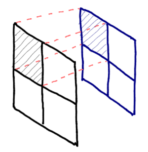

# Coregistration

Qgis processing plugin for image to image co-registration, projection and pixel alignment based on a target image.

It generates a new raster file base on the target image with all properties from the reference image in order to have an image to image co-registration. The co-registration process include:

* Reprojection (only if needed)
* Resampling (only if pixel sizes are different)
* Pixel alignment
* Apply a mask as an area of interest (optional)

## Basic demo

You can test it using a simple basic example in this [zip file](files_demo.zip) with a reference file and two target images.

## Source code

The official version control system repository of the plugin:
[https://github.com/SMByC/Coregistration-Qgis-processing](https://github.com/SMByC/Coregistration-Qgis-processing)

## Issue Tracker

Issues, ideas and enhancements: [https://github.com/SMByC/Coregistration-Qgis-processing/issues](https://github.com/SMByC/Coregistration-Qgis-processing/issues)

## License

This plugin is a free/libre software and is licensed under the GNU General Public License.
