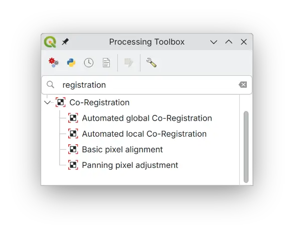

# Coregistration

Image to image automatic co-registration processing QGIS plugin. This plugin uses AROSICS to perform automatic subpixel co-registration of image datasets based on an image matching approach working in the frequency domain.

_This plugin has four algorithms:_

<div align="center">

</div>

### (1) Basic pixel alignment

<div align="center">

</div>

This QGIS processing generates a new raster file based on the target image, reprojected and resampled to match all spatial properties of the reference image. This process does not examine pixel content — it adjusts the target image geometrically to align its pixel grid with the reference. The basic pixel alignment process includes:

* Reprojection (only if needed)
* Resampling (only if pixel sizes are different)
* Extent/bounds adjustment

For content-based image-to-image co-registration use algorithms (3) or (4) instead.

### (2) Panning pixel adjustment

<div align="center">

</div>

The Panning Pixel Adjustment algorithm provides a simple way to manually shift an image in the X (longitude) and Y (latitude) directions. The shift values are expressed in pixel units and can be fractional. This algorithm is not automatic — the user must specify the pixel shift in X and Y. Skipping the output will overwrite and update the georeferencing of the input file in place.

## Automated global and local image to image co-registration

Detects and corrects global and local X/Y shift misregistrations between two input images at subpixel precision, using the pixel content within a matching window. Performs automatic subpixel co-registration based on frequency-domain image matching (phase correlation), combined with a multistage workflow for effective detection of false-positives [1].

It is designed to robustly handle the typical difficulties of multi-sensor/multi-temporal images. Clouds and other outliers are automatically handled by the implemented outlier detection algorithms [1].

### (3) Global

<div align="center">

</div>

Computes a single X/Y translation offset for the entire image by matching a small window within the image overlap area. This is the fast option, correcting translational shifts only. Best used when the target image requires a uniform shift in one direction across its full extent.

Key parameters: matching window center and size, maximum shift distance.

### (4) Local

<div align="center">

</div>

Computes a dense tie point grid across the image overlap, validates each point through a multistage outlier detection workflow, and derives a spatially variable correction that is applied by warping the target image. Best used when the target image has spatially varying misregistration — i.e., different shifts in different areas.

The accuracy of this algorithm depends primarily on two parameters: tie point grid resolution and matching window size. It is significantly more comprehensive and slower than the global algorithm.

Key parameters: tie point grid resolution, matching window size, maximum shift distance.

*[1] These algorithms use AROSICS software developed by Daniel Scheffler, for more info <a href="https://danschef.git-pages.gfz-potsdam.de/arosics/doc/">documentation</a> and <a href="https://doi.org/10.3390/rs9070676">paper (Scheffler et al. 2017, Remote Sensing 9(7):676)</a>.

## Installation

The plugin can be installed using the QGIS Plugin Manager, go into Qgis to `Plugins` menu and `Manage and install plugins`, in `All` section search for `Coregistration`.

The plugin will be available in the `Processing Toolbox` or you can search and open it directly from the `Statusbar`.

> **Dependencies:**
    This plugin requires additional Python packages (`AROSICS` and its dependencies), that are generally not part of QGIS's Python. The plugin try to install all the dependencies for you in a local folder automatically in the installation process.

#### Windows
The plugin should work directly without any additional steps with a Qgis version >= 3.34 on a 64bit Windows system, if you have issues with this try with the alternative installation below.

> **Note:** Updating or reinstalling this plugin may require a **QGIS restart** to complete the installation, especially on Windows where library files may be locked by the running QGIS process.

### Alternative installation

If you have problems with the dependencies, the best options to solve it is use [conda](https://docs.conda.io/en/latest/miniconda.html) and install AROSICS and Qgis (from the conda shell):

```bash
conda install -c conda-forge arosics qgis
```

After that open Qgis from the shell with `qgis` command. Then install the plugin.

## About Us

Coregistration plugin was developed by the Forest and Carbon Monitoring System (SMByC) at the Institute of Hydrology, Meteorology and Environmental Studies (IDEAM) in Colombia. SMByC is responsible for measuring and ensuring the accuracy of official national forest figures.

- [Xavier C. Llano](https://github.com/XavierCLL) - Author and lead developer
- [SMByC-PDI team](https://github.com/SMByC) - Development support and testing

This project was fully funded by the SMByC-IDEAM, Colombia.
